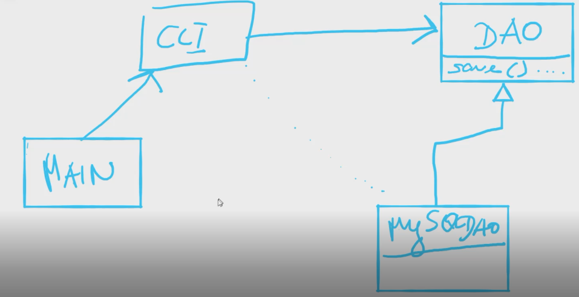
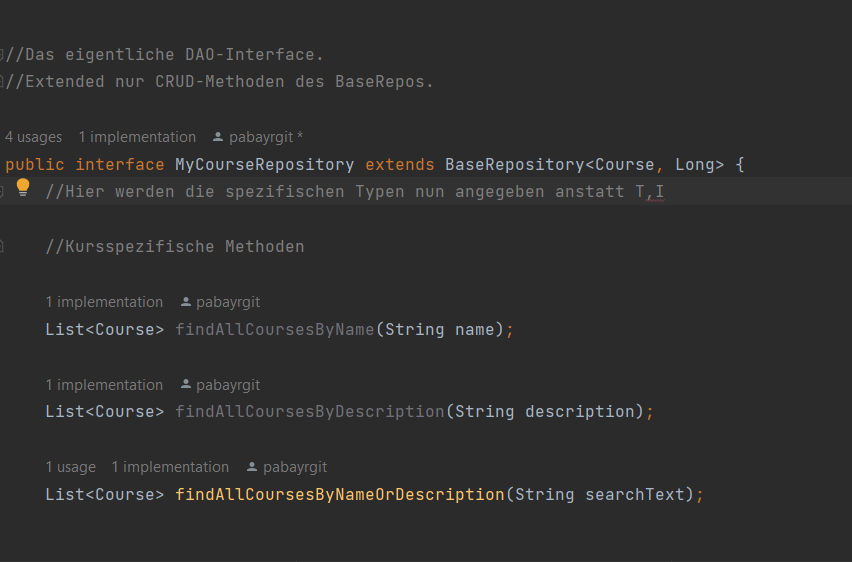
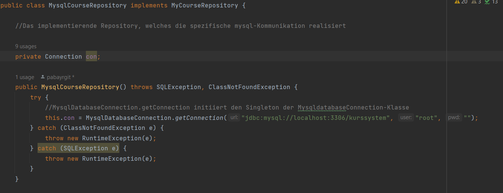

# mycoursesystem
DAO Pattern anhand eines Kurssystems

# DAO
* steht für Data Access Object.
* ist ein Pattern, um den Zugriff verschiedenster Quellen so zu kapseln, ohne den Code groß verändern zu müssen.
* somit ein Muster für Gestaltung von APIs.

## Objektrelationales Mapping

Da OO Programmierung Daten und Verhalten stark kapselt erschwert es die Kommunikation mit relationalen Datenbanken.
Diese konzeptionellen Probleme können hier weiters nachgelesen werden:
https://de.wikipedia.org/wiki/Object-relational_impedance_mismatch

Das DAO Pattern übernimmt quasi  die Transformation der aus der Datenquelle(in unserem Fall sqldb)  kommenden Daten in die von der Applikation (Domäne kurssystem in java+jdbc) gewünschte Form.

